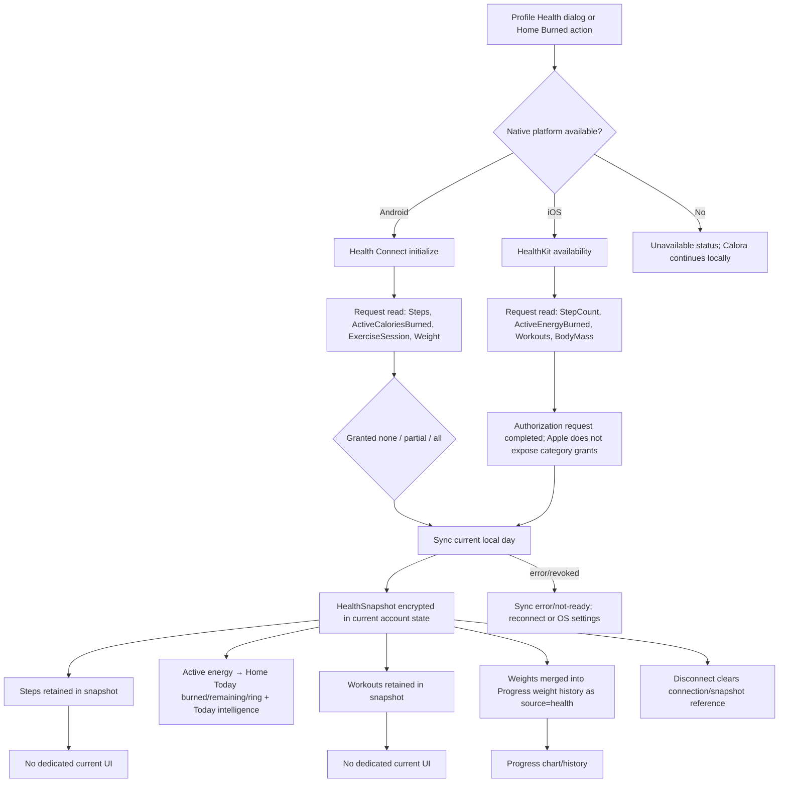
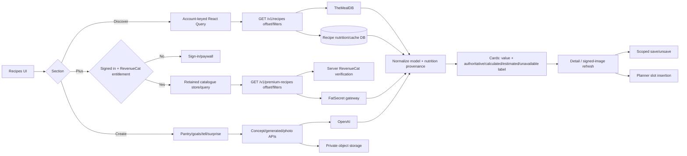
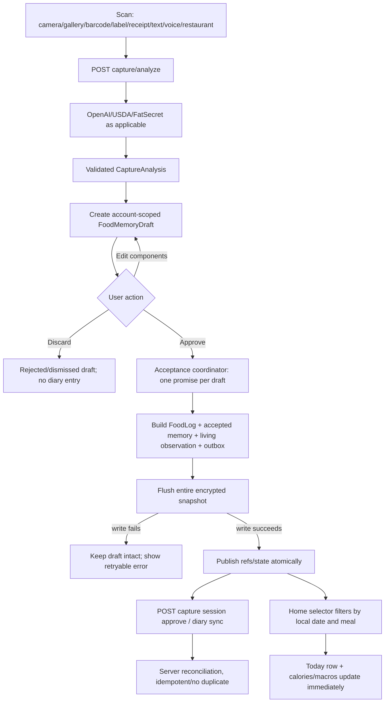
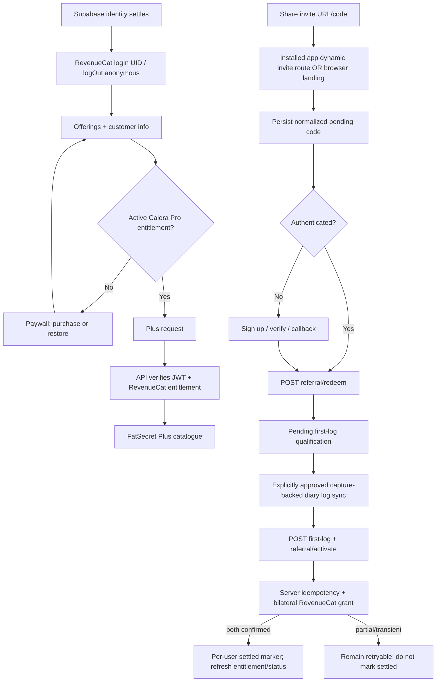

# Calora Complete User-Flow Forensic Map

**Artifact:** `17_CALORA_COMPLETE_USER_FLOW_FORENSIC_MAP.md`  
**Scope:** current repository working tree after post-install remediation; mobile app, API routes, generated OpenAPI client, contexts, local persistence, providers, and deterministic tests  
**Evidence basis:** static inspection of `artifacts/calora`, `artifacts/api-server`, `lib/api-spec/openapi.yaml`, generated API client/schema packages, database schema/migrations, and existing tests  
**Operational boundary:** this map does **not** claim physical-device validation. This mission performs no build, push, publish, republish, DNS change, Supabase configuration change, or RevenueCat dashboard change.

---

## 1. Application architecture overview

Calora is an Expo Router React Native application backed by an Express API and managed PostgreSQL. The app is deliberately local-first for most domain state:

```text
Expo Router UI
  ├─ AuthProvider ── Supabase Auth session in SecureStore
  └─ AccountScopedProviders, keyed by Supabase user id or "guest"
       ├─ CaloraProvider ── encrypted account-scoped snapshot in AsyncStorage
       ├─ account-keyed React Query client
       ├─ SubscriptionProvider ── RevenueCat identity/offering/entitlement
       ├─ DiarySyncWorker ── authenticated diary reconciliation
       ├─ ReferralActivator
       ├─ notification listener/inbox boundary
       └─ navigation stack and tab screens

Mobile API client ── Bearer access token ── Express /api
  ├─ Supabase JWT verification / Admin account deletion
  ├─ managed PostgreSQL domain data via Drizzle
  ├─ OpenAI: capture, generated recipes/photos, planner, Coach Fact Context
  ├─ TheMealDB: Discover recipe catalogue
  ├─ FatSecret: Plus recipes and restaurant nutrition
  ├─ RevenueCat REST: server entitlement/reward/deletion operations
  └─ object storage: generated private recipe photos
```

### State ownership

| Owner | Owns | Does not own |
|---|---|---|
| `AuthContext` | Supabase session/user, auth bootstrap, password-recovery event, sign-in/up/out/recovery actions | diary, profile, subscription, onboarding |
| `CaloraContext` | onboarding/profile, logs, weights, water/mood/activity, recipes/saves, planner/shopping, health snapshot, reminders, Coach history/consent mirror, food/living memory, outbox, display preferences | external identity and store billing truth |
| React Query | server catalogue/detail results and RevenueCat query results; query client is recreated per account | durable local domain snapshot |
| `SubscriptionProvider` | RevenueCat SDK identity, offerings, customer info, purchase/restore pending states | server-side reward ledger |
| Express/API | authenticated provider gateway, capture approval, diary reconciliation, referrals, deletion fence | native health permission UI or local reminder scheduling |
| PostgreSQL | user/domain rows, diary/capture/referral/sync/Coach consent and idempotency records, deletion fences/recovery state | guest local state |

### Important invariants

1. Auth restore completes before a guest/account `CaloraProvider` mounts.
2. Auth identity changes key and unmount all account-scoped state and query caches.
3. The local domain snapshot is encrypted, namespaced by account, and hydrated before routing from onboarding.
4. Capture analysis is only a draft; explicit approval is the diary commit boundary.
5. Health is read-only and local; only imported weight records join Progress history.
6. RevenueCat entitlement is checked both in the client UX and by the API for Plus.
7. Local diary remains usable offline; authenticated reconciliation is best effort.

---

## 2. Complete screen inventory

### File-backed screens

| Screen | File | Reachability and principal UI |
|---|---|---|
| Onboarding / root gate | `app/index.tsx` | `/`; seven-step onboarding, hydration loading/recovery, review mode |
| Home / Today | `app/(tabs)/index.tsx` | default tab; date/calendar, calorie ring, burned energy, macros, diary, food actions, water/mood, recipes, local insights |
| Recipes | `app/(tabs)/recipes.tsx` | tab; Discover, Plus, Create, filters/search, cards, details, save, planner insertion |
| Smart Scan | `app/(tabs)/scan.tsx` | center tab; camera/gallery, barcode, label, receipt, text/voice description, review and acceptance |
| Progress | `app/(tabs)/insights.tsx` | tab titled Progress; Overview/Insights/Weight sections, charts, daily check-ins, memory and shopping shortcuts |
| Plan | `app/(tabs)/planner.tsx` | tab; plan type, generation, week/day navigation, replace/move/copy/delete/undo, shopping list |
| Profile | `app/(tabs)/profile.tsx` | hidden tab reachable by buttons/routes; You/Membership/Account, settings, paywall, notifications, health, export/delete |
| Coach | `app/coach.tsx` | root stack modal-like screen; guest explanation or authenticated Fact Context Coach |
| Memory | `app/memory.tsx` | root stack; remembered signals, correct/forget/undo and stale cleanup |
| Restaurants | `app/restaurants.tsx` | root stack; authenticated FatSecret search/detail/review into Scan |
| Saved recipes | `app/saved-recipes.tsx` | root stack; source filters, saved details, unsave and planner insertion |
| Invite | `app/invite/[code].tsx` | deep-link landing handoff; persists valid code and redirects to Profile or sign-up |
| Sign in | `app/auth/sign-in.tsx` | email/password and Google OAuth |
| Sign up | `app/auth/sign-up.tsx` | email/password/confirmation, pending invite notice, Terms/Privacy links |
| Verify email | `app/auth/verify-email.tsx` | confirmation instructions and resend |
| Forgot password | `app/auth/forgot-password.tsx` | send/resend recovery email |
| Auth callback | `app/auth/callback.tsx` | OAuth/email/recovery callback processing and redirect |
| Reset password | `app/auth/reset-password.tsx` | recovery-session password update, expired-link state |
| Not found | `app/+not-found.tsx` | briefly displays unknown-path state, then replaces with `/` |
| Meal-image QA preview | `app/meal-image-preview.tsx` | file-discovered diagnostic route; image provenance/catalog audit |
| Encrypted-recovery QA preview | `app/encrypted-recovery-preview.tsx` | file-discovered diagnostic smoke route; executes encrypted recovery checks |

### Embedded screens, sheets, and meaningful states

| Host | Embedded surface/state inventory |
|---|---|
| Onboarding | welcome; goal; name/age; height/current/goal weight; activity; food preference; required agreement; loading; parse/storage error; review/edit |
| Home | calendar sheet; quick add/search/manual sheet; diary edit/delete; macro-target editor; restaurant/camera launch; empty diary; sync/local notice; Today insight |
| Recipes | recipe detail; local recipe creator; AI concept modes (pantry/goals/tell/surprise); nutrition retry; save/unsave; Plus gate/paywall; pagination footer/error |
| Scan | idle source chooser; native permission denial; capture/analysis loading; unavailable result; editable candidate review; acceptance failure/retry |
| Progress | expanded weight chart; log/edit/delete weight; undo snackbar; goal editor/celebration; check-ins; data-empty charts |
| Planner | plan-type onboarding; generation confirmation; replace chooser; move/copy; deletion and undo; shopping-list sheet |
| Profile | profile editor; nutrition goals; theme/font/units; saved meals; purchase/confirm/restore; referral card; notification configuration; health dialog; privacy/export; local/account deletion confirmation; food-data/no-ads/help information |
| Coach | consent panel; empty prompt suggestions; sending; rendered message history; bounded error/retry; clear history confirmation |
| Error boundary | global fallback and clear-local-data escape |

---

## 3. Complete route inventory

Expo Router groups do not contribute a URL segment. Both grouped and shorthand strings can therefore refer to the same public path; the code uses both forms.

| Route / route form | Backing file | Kind | Notes |
|---|---|---|---|
| `/` | `app/index.tsx` and tabs index resolution | root/alias | Onboarding gate at root file; notification handler also navigates `/`; completed onboarding redirects to `/(tabs)` |
| `/(tabs)` / `/(tabs)/index` | `(tabs)/index.tsx` | tab | Home/Today |
| `/(tabs)/recipes` and `/recipes` alias | `(tabs)/recipes.tsx` | tab | Recipes |
| `/(tabs)/scan` and `/scan` alias | `(tabs)/scan.tsx` | tab | Smart Scan |
| `/(tabs)/insights` and `/insights` alias | `(tabs)/insights.tsx` | tab | title is Progress |
| `/(tabs)/planner` and `/planner` alias | `(tabs)/planner.tsx` | tab | Plan |
| `/(tabs)/profile`, `/profile`, `/profile?tab=account&open=health` | `(tabs)/profile.tsx` | hidden tab | not shown in tab bar; programmatic entry |
| `/coach` | `app/coach.tsx` | root stack | current Coach UI |
| `/memory` | `app/memory.tsx` | root stack | living/food memory |
| `/restaurants?date=YYYY-MM-DD` | `app/restaurants.tsx` | root stack | returns selection to Scan |
| `/saved-recipes` | `app/saved-recipes.tsx` | root stack | saved shelf |
| `/invite/[code]` | `app/invite/[code].tsx` | dynamic/deep link | code handoff |
| `/auth/sign-in` | auth screen | auth stack | optional `redirect` parameter |
| `/auth/sign-up` | auth screen | auth stack | pending invite supported |
| `/auth/verify-email?email=…` | auth screen | auth stack | resend |
| `/auth/forgot-password` | auth screen | auth stack | reset request |
| `/auth/callback` | auth screen | associated-link target | OAuth, verification, recovery |
| `/auth/reset-password` | auth screen | auth stack | requires recovery session |
| `/meal-image-preview` | diagnostic screen | auto-discovered | no normal product navigation found |
| `/encrypted-recovery-preview` | diagnostic screen | explicitly mounted and auto-discovered | no normal product navigation found |
| any unknown route | `+not-found.tsx` | fallback | redirects to `/` after 300 ms, masking bad paths |

External web routes served by the API host include `/`, `/privacy`, `/terms`, `/subscriptions`, `/delete-account`, `/support`, `/contact`, `/help`, `/robots.txt`, `/sitemap.xml`, `/site.webmanifest`, assets, `/auth/callback`, `/.well-known/apple-app-site-association`, `/.well-known/assetlinks.json`, `/invite`, and `/invite/:code`. Legal pages are also mounted under `/api/legal`, producing intentional-but-duplicate mounts such as `/api/legal/privacy`.

---

## 4. Complete user-flow inventory

The canonical inventory is **A–V**, matching the mission taxonomy:

- **A Boot:** first install, returning guest/account, offline, expired session, stale/corrupt state.
- **B Onboarding:** all seven steps, validation, keyboard, back/continue, required consent, durable completion, review and account-specific re-entry.
- **C Authentication:** email/Google sign-in, sign-up, verification/resend, callback, recovery, sign-out/switch, deleted identity.
- **D Home/Today:** dates, ring/macros/burned energy, diary, water/mood, recipe/Coach/Profile shortcuts and empty/loading/error states.
- **E Food logging:** quick search/manual, recent/memory, restaurant, barcode, camera/gallery/label/receipt/text/voice, review, edit/delete, date/meal. No distinct favorite or one-tap duplicate control was found; saved meals/repeat memory are the implemented reuse mechanisms.
- **F Recipes:** Discover, Plus, Create, search/filter, pagination, detail/nutrition/images, saved shelf, planner.
- **G Planner:** program/plan type, generation, week/day, replace/move/copy/delete/undo, recipe insertion, shopping.
- **H Shopping:** generated items, manual/check/uncheck/remove behavior exposed through planner sheet, persistence and week checks.
- **I Coach:** guest/auth, consent, first and multi-turn messages, persistence, clear, rapid send, offline/provider/schema failures.
- **J Intelligence:** living state, Today insight, post-log insight, weekly/nutrition/weight facts, memory navigation.
- **K Progress:** overview/insights/weight, charts, history, goals, check-ins, edit/delete/undo and empty states.
- **L Health:** native capability, permission, read/sync/display/disconnect/revocation/unavailable.
- **M Profile:** profile/preferences/units/theme/font, goals, reminders, health, export, clear/delete, support.
- **N Pro:** offerings/paywall, entitlement, purchase/restore, Plus authorization, expiry/offline.
- **O Referral:** share/link/browser/app landing, pending code, redeem, first approved log, bilateral reward, invalid/duplicate.
- **P Notifications:** explicit permission, local scheduling/reconciliation, receive/inbox/tap, disable and account scope.
- **Q Legal/support:** privacy, terms, subscriptions, contact/help, deletion instructions.
- **R Links:** auth and invite associated links, installed/uninstalled/browser fallback, invalid path.
- **S Offline/network:** local-first reads/mutations, diary retry, provider errors, conflict reconciliation and limitations.
- **T Deletion:** local clear and authenticated permanent deletion, confirmation, server fence/recovery, cleanup/sign-out/deleted return.
- **U Accessibility:** screen reader, Dynamic Type, reduced motion, focus/keyboard, touch targets, contrast.
- **V Errors:** HTTP 400/401/403/404/409/429/5xx, timeout, provider/schema/offline/permission and global storage/render errors.

---

## 5. Flow table using the required format

**Column interpretation:** “UI state” includes the component plus loading/empty/error state. “Storage/API/provider” combines local storage, endpoint, database/provider effect. “Failure destination/recovery” includes offline handling. Priority is residual release significance: no current P0/P1/P2 blocker is identified after remediation; `P2-hardening` and `P3` denote follow-up work, not blockers.

### A. App boot

| Flow ID | Entry point | Preconditions | User action | UI state | State owner | Storage/API/provider | Success destination | Failure destination/recovery | Account/privacy boundary | Tests | Priority |
|---|---|---|---|---|---|---|---|---|---|---|---|
| A1 First install | OS launch `/` | no Supabase session; no scoped snapshot | open app | splash/fonts → “Loading your data…” → onboarding 1/7 | AuthContext then CaloraContext | SecureStore auth empty; encrypted `…:guest` empty | onboarding welcome | storage I/O screen; retry/clear as allowed | never hydrate guest before auth restore settles | hydration, onboarding, accountStorage | OWNER DEVICE TEST |
| A2 Returning guest | OS launch | guest snapshot exists | open/relaunch | hydration gate; no onboarding flash | CaloraContext | encrypted guest snapshot | Home if complete; saved step if incomplete | parse: export encrypted envelope/clear; transient I/O: retry | guest key only | hydrationRetry, onboardingScreen, encryptedStorage | P2-hardening |
| A3 Returning account | OS launch/deep link | SecureStore session and account snapshot | open app/link | auth restore blank gate → account hydration | AuthContext/CaloraContext | Supabase Auth; `…:<encoded uid>` | Home or intended callback target | expired session becomes guest/sign-in path; API 401 refreshes once | account provider/query cache keyed before render | real_auth, auth logic, account isolation | OWNER DEVICE TEST |
| A4 Offline boot | OS launch, airplane mode | valid local snapshot | open app | local UI available; remote cards may error | local contexts | encrypted local state; cached queries where retained in mount | Home/local features | provider retry controls; authenticated sync retries in 5 s while mounted | no fallback to another account | diarySync, hydration | P2-hardening |
| A5 Corrupt/stale state | `/` | encrypted envelope unreadable or schema invalid | launch/retry | explicit parse/storage error | hydration effect/PersistenceManager | encrypted snapshot + schema migration | recovered state | encrypted export, retry, or destructive clear with confirmation | only current namespace is exported/cleared | hydrationGuard, clearAllData, errorScreenActions | P2-hardening |

### B. Onboarding

| Flow ID | Entry point | Preconditions | User action | UI state | State owner | Storage/API/provider | Success destination | Failure destination/recovery | Account/privacy boundary | Tests | Priority |
|---|---|---|---|---|---|---|---|---|---|---|---|
| B1 Welcome/goal | `/`, steps 1–2 | hydrated; incomplete | Continue; choose lose/maintain/gain; Back | scrollable illustrated options/progress | CaloraContext draft/step | encrypted scoped snapshot autosave | personal basics | remain on current step | selection belongs to active guest/account | onboardingScreen | OWNER DEVICE TEST |
| B2 Name/age | step 3 | incomplete | type name and decimal age | keyboard-aware scrolling; Continue reachable | local component + draft | encrypted scoped snapshot | metrics | validation later returns here with alert text | no cross-account draft | onboardingScreen | OWNER DEVICE TEST |
| B3 Metrics | step 4 | name/age captured | enter height/current/goal weight | keyboard-aware fields; live calorie estimate; inline error | component/CaloraContext | local calculation, encrypted draft | activity | invalid/range input stays with accessible error | sensitive body data encrypted in current scope | profileTargets, calorie recommendation | OWNER DEVICE TEST |
| B4 Activity/diet | steps 5–6 | valid metrics | select level and diet; back/continue | radio-like cards/chips | CaloraContext draft | encrypted snapshot | agreement | prior choices remain | current scope only | onboardingScreen | P3 |
| B5 Consent/complete | step 7 | valid profile; unchecked by default | tap prominent required checkbox, then Agree & enter Calora | disabled final action until checked; durable saving | CaloraContext/PersistenceManager | atomic snapshot sets profile, consent, complete; flush before navigation | Home; review mode returns Profile | save failure keeps setup open and asks retry | consent/profile are scope-specific; never globally inherited | onboardingScreen, exportOnboardingBoundary, clearAllData | OWNER DEVICE TEST |
| B6 Relaunch/review/switch | cold launch or Profile edit | completed current scope | relaunch or open review; sign into another account | redirect only after hydration; review prefilled | keyed CaloraProvider | account-specific encrypted snapshot | Home/Profile for same account; other account’s own state | hydration error recovery, never global completion fallback | hard A→B→guest fence | accountStorage, hydration integration, real_auth | OWNER DEVICE TEST |

### C. Authentication

| Flow ID | Entry point | Preconditions | User action | UI state | State owner | Storage/API/provider | Success destination | Failure destination/recovery | Account/privacy boundary | Tests | Priority |
|---|---|---|---|---|---|---|---|---|---|---|---|
| C1 Email sign-in | Profile/Coach/saved/Plus → sign-in | network; verified credentials | enter email/password | keyboard form, pending, bounded error | AuthContext | Supabase Auth; SecureStore session | redirect or Home; provider remounts account | invalid/unverified/offline remains form; verification/recovery links | guest memory is not silently assigned to account | auth_logic, real_auth | OWNER DEVICE TEST |
| C2 Google sign-in | sign-in | Google provider available | tap Google | single-flight OAuth browser/callback | AuthContext/auth helper | Supabase OAuth, associated link | callback → Home/intended route | cancellation/error → sign-in/root with message | code exchange deduped; new UID causes hard remount | auth tests, native-auth scripts, universal-links API tests | OWNER DEVICE TEST |
| C3 Sign-up/verify | sign-up | valid email/password; optional invite | create account; open email; resend | validation/pending; Check your email | AuthContext | Supabase Auth; pending invite local key | callback/sign-in then account scope | existing/weak/offline error; resend retry | pending invite contains code, not another user’s data | auth tests, referralPersistence | OWNER DEVICE TEST |
| C4 Password recovery | forgot password/email link | account email; valid link | send/resend, open link, set matching password | sent, callback, recovery form, expired/success | AuthContext recovery flag | Supabase Auth | Home after update | expired link → forgot-password; validation remains | callback must not expose token; recovery state cleared | auth logic, universal-links | OWNER DEVICE TEST |
| C5 Sign-out/account switch | Profile account | authenticated | sign out then sign in as B | RevenueCat/query/domain providers remount | AuthContext/root layout | Supabase sign-out; RevenueCat logout/login; scoped stores | guest or B’s Home/onboarding | auth failure surfaces; old in-memory scope already unmounted on identity event | hard cache, health, Coach, notification fence | authSignOut, isolation tests | OWNER DEVICE TEST |
| C6 Deleted account return | sign-in/deep link | account previously deleted | attempt auth/API use | auth error or API denied | Supabase/deletion fence | Supabase Admin deletion + one-way fence | sign-up/support as appropriate | no domain recreation; support path | deleted identity cannot regain old rows | account/deletion-fence tests | OWNER DEVICE TEST |

### D. Home / Today

| Flow ID | Entry point | Preconditions | User action | UI state | State owner | Storage/API/provider | Success destination | Failure destination/recovery | Account/privacy boundary | Tests | Priority |
|---|---|---|---|---|---|---|---|---|---|---|---|
| D1 Today dashboard | Home tab | onboarded/hydrated | view day | greeting, calorie ring, macros, water, diary/living state | CaloraContext/selectors | local snapshot; Health active energy; `/v1/recipes?limit=6` | same screen | recipe widget loading/error does not block diary | selectors read current scope/date only | homeScreen, healthDayAndBurnedStatus, livingState | OWNER DEVICE TEST |
| D2 Date/history | date arrows/calendar | hydrated | choose previous/next/day, Back to today | selected-date ring/diary | component session state + local logs | no API required | chosen day | empty day is valid; calendar dismiss | no storage mutation | dates, homeScreen | P3 |
| D3 Add/edit/delete diary | `+`, diary row | hydrated | search/manual add; edit; delete/undo where offered | modal, validation, optimistic local result | CaloraContext | encrypted snapshot/outbox; `/v1/diary`, `/v1/sync` when auth | updated Today/date | save validation remains; sync retries without removing local entry | user token and account-keyed reconciliation | diarySync/API diary tests | OWNER DEVICE TEST |
| D4 Water/mood/action | Home cards | hydrated | add water, choose mood, follow living action | confirmation lock/live update | CaloraContext | encrypted snapshot | same screen/Progress/Planner | local write error only visible through hydration lifecycle; double tap guarded for water | current account day | waterConfirmation, wellnessWaterButton, livingState | P3 |
| D5 Shortcuts | Home header/widgets | route available | Coach/Profile/Recipes/Camera/Restaurant/Health action | navigation | router + contexts | destination-specific | selected destination | unknown route falls to root; provider errors at destination | profile/health/restaurant gates preserved | homeScreen/navigation helpers | P2-hardening |

### E. Food logging

| Flow ID | Entry point | Preconditions | User action | UI state | State owner | Storage/API/provider | Success destination | Failure destination/recovery | Account/privacy boundary | Tests | Priority |
|---|---|---|---|---|---|---|---|---|---|---|---|---|
| E1 Quick/manual/recent | Home Add sheet | hydrated | search/select or enter nutrition, meal/date | input/recent-memory/validation | component + CaloraContext | local encrypted snapshot; diary sync if auth | Home chosen date | invalid stays modal; offline local commit works | current scoped diary | foodMemory, diarySync, homeScreen | OWNER DEVICE TEST |
| E2 Restaurant | Home/Scan restaurant action | signed in | search ≥2 chars, paginate, open serving, review | loading/list/detail/provider-empty | React Query + Scan draft | `GET /v1/restaurant-foods[/:id]`; FatSecret | Scan review → accepted diary | 400 prompt, 401 sign-in, 429/503/502 retry; no fabricated result | token/rate bucket/current draft | restaurant tests | OWNER DEVICE TEST |
| E3 Barcode/label/receipt | Scan | permission/input available | capture source | analysis pending → candidates | Scan + CaloraContext draft | `POST /v1/capture/analyze`; OpenAI/USDA; PostgreSQL capture rows | review | unavailable/malformed/timeout shown; retry/new capture | image/input sent only for active request; auth ownership when present | capture tests, captureReview | OWNER DEVICE TEST |
| E4 Camera/gallery photo | Scan | native camera/media permission | take/select photo and analyze | permission, preview/loading/review | Scan/useAnalyzeCapture | capture endpoint/OpenAI; local draft | explicit review | denial → settings/retry; analysis-only never enters diary | no commit before approval | capture API and persistence tests | OWNER DEVICE TEST |
| E5 Text/voice description | Scan | text; microphone for voice | dictate/type, edit transcript, estimate | multiline keyboard state/loading | Scan | capture endpoint; OpenAI audio transcription for voice | review | permission/offline/provider error; transcript stays editable | bounded input; no raw provider error | capture tests | OWNER DEVICE TEST |
| E6 Accept/reject | review | valid draft, hydration complete | edit components; Approve or Not this meal | single-flight acceptance; success/error | CaloraContext coordinator | local durable flush; `POST /v1/capture/:sessionId/approve`; outbox/diary sync | Scan reset/Home Today shows log | failed local write leaves draft retryable; duplicate taps share promise | draft/log scoped; approved server session verified | captureAcceptanceCoordinator/Persistence, capture API | OWNER DEVICE TEST |
| E7 Reuse/edit/delete | diary/memory/saved meal | existing own entry | correct, change meal/date, delete, reuse saved/repeat item | editor/confirm/undo | CaloraContext | encrypted state and diary delete ledger | same selected day | offline delete queued/retried; conflict merge by timestamp/signature | never merge other account’s IDs | diarySync, foodMemory, memory tests | P2-hardening |

### F. Recipes

| Flow ID | Entry point | Preconditions | User action | UI state | State owner | Storage/API/provider | Success destination | Failure destination/recovery | Account/privacy boundary | Tests | Priority |
|---|---|---|---|---|---|---|---|---|---|---|---|
| F1 Discover | Recipes → Discover | hydrated | filter/search/scroll/open | cached cards; loading/empty/error; explicit nutrition provenance/unavailable | component + React Query | `GET /v1/recipes[/:id]`; TheMealDB + DB nutrition cache | detail | retry; saved/local recipes remain usable offline | query is recreated per account; public catalogue not personal | recipesScreen, recipeModel, API recipes/TheMealDB | OWNER DEVICE TEST |
| F2 Discover pagination/freshness | Discover near end/remount | next offset exists | scroll or revisit | existing cards stay; footer load/retry; stable account/day rotation | premium catalogue/list state | list endpoint offset/limit | unique append/no jump | terminal reason only on true exhaustion/provider ceiling | no cross-account seen-state/cache | recipeModel/recipes API tests | OWNER DEVICE TEST |
| F3 Plus gate/catalogue | Recipes → Plus | signed in; entitlement | open default unfiltered Plus, long-scroll, quick-remount, background/activate | paywall/sign-in; same-account/same-day exact retained cards/order/filter/cursor/terminal/scroll; footer | SubscriptionProvider + account-keyed catalogue/session store/query | RevenueCat + `GET /v1/premium-recipes?freshnessDay=YYYY-MM-DD`; FatSecret | Plus detail | 401/403 clear protected list/detail caches, lifted/saved/session state and selected detail; 429/502/503 retry with old cards retained | API verifies token and entitlement; account fence clears all protected Plus state | premium access/query/refresh/catalogue/API tests | OWNER DEVICE TEST |
| F4 Create concepts | Recipes → Create | guest or auth | pantry/goals/tell/surprise inputs; generate | keyboard form/loading/concepts | component | guest/auth concepts + generated/photo endpoints; OpenAI/object storage | generated detail/local recipe | bounded provider message/retry; no fake result | auth token where required; generated private image reference | recipeGeneration, instructions/API generation | P2-hardening |
| F5 Detail/nutrition/image | any recipe card/saved | recipe id/model | inspect ingredients/instructions/nutrition, retry photo | detail loading, image fallback, nutrition provenance | React Query + local recipes | detail/photo/photo-url; provider/object storage | same modal | stale signed URL refresh; unavailable nutrition explicitly labeled | private signed image URL and own local recipe | recipe detail/image/nutrition tests | OWNER DEVICE TEST |
| F6 Save/unsave/planner | detail or saved shelf | hydrated; Plus saves may require identity | save, unsave, Add to plan | immediate saved state/notice | CaloraContext + premium saved store | encrypted scoped snapshot; no catalogue mutation | saved shelf or Planner target | missing source shows reconnect notice; retry detail | saved IDs/local recipes account-scoped | premiumSavedRecipes, recipe tests | OWNER DEVICE TEST |

### G. Planner

| Flow ID | Entry point | Preconditions | User action | UI state | State owner | Storage/API/provider | Success destination | Failure destination/recovery | Account/privacy boundary | Tests | Priority |
|---|---|---|---|---|---|---|---|---|---|---|---|
| G1 Plan setup/generation | Plan tab | hydrated; choose plan type | select diet/program, fill/rebuild week | confirmation/loading/celebration | CaloraContext + mutation | `POST /v1/planner/generate`; OpenAI or starter catalogue | populated week | API error keeps current plan and permits retry | request uses current profile/preferences only | planner, planType, API planner | OWNER DEVICE TEST |
| G2 Week/day navigation | Plan header | planner exists | change week/day | selected week/day; empty slot | persisted week start + session viewed day | encrypted snapshot | selected week | no network needed | account scope | planner tests | P3 |
| G3 Meal operations | meal/slot menu | own plan | replace, move, copy, delete, undo | sheets/ack/snackbar | CaloraContext | encrypted planner/shopping rebuild | updated week | invalid destination/no candidate remains; undo restores | IDs and state current account | plannerReplace, plannerAck, plannerIntegrity | OWNER DEVICE TEST |
| G4 Recipe insertion/logging | Recipe detail or planner meal | target slot/meal | add recipe; review/log meal | target/ack or food-memory review | CaloraContext | local recipe/planner/draft/log; diary sync | Planner or Home | duplicate planner logging returns existing log | current account recipe and planner ids | planner, foodMemory, capture acceptance | P2-hardening |

### H. Shopping list

| Flow ID | Entry point | Preconditions | User action | UI state | State owner | Storage/API/provider | Success destination | Failure destination/recovery | Account/privacy boundary | Tests | Priority |
|---|---|---|---|---|---|---|---|---|---|---|---|
| H1 Generate/rebuild | Planner shopping button | planner meals | open list/rebuild via plan changes | grouped generated list/empty | CaloraContext | locally derived from planner; encrypted | shopping sheet | empty week explains no items | current planner only | planner tests | P3 |
| H2 Add/remove/check | Shopping sheet | list present | check/uncheck and use available item controls | immediate row state/filter | CaloraContext | `checkedByWeek`, quantities/source meal IDs in snapshot | same sheet | local persistence; retry via reopening after storage issue | week-specific checks, account namespace | planner/shopping utility tests | P2-hardening |
| H3 Week switch | Plan week then shopping | multiple weeks | navigate week/open list | check state for selected week | CaloraContext | encrypted `checkedByWeek` map | selected week’s list | no remote dependency | no cross-week/account accidental carry | planner tests | P2-hardening |

### I. Coach

| Flow ID | Entry point | Preconditions | User action | UI state | State owner | Storage/API/provider | Success destination | Failure destination/recovery | Account/privacy boundary | Tests | Priority |
|---|---|---|---|---|---|---|---|---|---|---|---|
| I1 Guest Coach | Home/Scan Coach | guest | open or choose sign-in | bounded guest explanation/suggestions | guestCoach/UI | no provider call | sign-in or back | remains guest; no fake AI | guest cannot submit personal Fact Context | guestCoach | OWNER DEVICE TEST |
| I2 Fact consent | Coach/Profile consent panel | authenticated | accept/revoke current consent version | loading/status/error; explicit panel | server consent + local cache/mirror | GET/POST consent endpoints; PostgreSQL consent events/current consent | Coach enabled or disabled | offline/provider failure remains gated; retry | consent keyed to verified JWT user; revoke invalidates lifecycle | consent cache/coordinator/API consent tests | OWNER DEVICE TEST |
| I3 First/multi-turn send | Coach | auth + valid consent + rollout | type/send suggestions or text | send lock, typing/loading, auto-scroll, ordered messages | CaloraContext history + send adapter lifecycle | `POST /v1/coach/fact-context/respond`; OpenAI + PostgreSQL idempotency/context facts | appended sanitized text | bounded 4xx/5xx/schema/timeout message and retry | server derives allowed facts for token owner; no broad client context | coachSendAdapter, factContext client/API | OWNER DEVICE TEST |
| I4 Rapid send/cancel/account switch | Coach | request in flight | tap rapidly, clear, leave, switch account | one active lifecycle; stale completion ignored | lifecycle epochs/coordinator | request id/idempotency | one response in active scope | duplicate suppressed; old response discarded; retry current input | account switch invalidates all epochs/cache/history provider | coordinator473/isolation tests | OWNER DEVICE TEST |
| I5 History/clear/offline | Coach | history exists or offline | return, clear, send offline | persisted ordered history; confirm clear; bounded error | CaloraContext | encrypted account snapshot; no outbox for Coach | same Coach | offline send is not queued; retry manually when connected | history never crosses keyed provider | coachContext, send adapter tests | OWNER DEVICE TEST |

### J. Insights / contextual intelligence

| Flow ID | Entry point | Preconditions | User action | UI state | State owner | Storage/API/provider | Success destination | Failure destination/recovery | Account/privacy boundary | Tests | Priority |
|---|---|---|---|---|---|---|---|---|---|---|---|
| J1 Living/Today insight | Home | hydrated local signals | view/action | rule-selected local card or no card | CaloraContext intelligence selectors | local logs/profile/check-ins/planner/active energy | local action destination | insufficient evidence yields no claim, not fake insight | current account facts only | intelligence foundation/hardening/performance, insightSelector | P2-hardening |
| J2 Post-log insight | accepted log | feature enabled | approve/add food | polite transient 4.2 s card | PostLog host/CaloraContext | session-only derived fact | remains current screen | cleared on hydration/account switch/timeout | source ID current scope | post-log/intelligence tests | P3 |
| J3 Progress facts | Progress Overview/Insights | adequate local records | change section | weekly patterns, nutrient balance, signals/empty states | pure context adapter/selectors | local snapshot | Progress | sparse data explicitly shown; no network requirement | no server Coach context leak | weeklySignals, nutrition/weight coverage | P2-hardening |
| J4 Memory | Progress memory icon | remembered observations | inspect/correct/forget/forget stale/undo | grouped memory, confirm, editor | CaloraContext living/food memory | encrypted snapshot | Memory | invalid date stays editor; destructive confirmation | account-scoped memory | livingMemory, memorySections/dates | OWNER DEVICE TEST |

### K. Progress

| Flow ID | Entry point | Preconditions | User action | UI state | State owner | Storage/API/provider | Success destination | Failure destination/recovery | Account/privacy boundary | Tests | Priority |
|---|---|---|---|---|---|---|---|---|---|---|---|
| K1 Sections/charts | Progress tab | hydrated | swipe/tap Overview, Insights, Weight; expand chart | accessible summaries and empty charts | component + CaloraContext | local logs/check-ins/weights | same section | no data shows explicit state | current account/date window | workspaceSwipe, weekly/weight tests | OWNER DEVICE TEST |
| K2 Weight CRUD | Weight section | hydrated | log/edit/delete; undo | keyboard sheet, chart selection, snackbar | CaloraContext | encrypted weight history/outbox metadata | updated chart | validation stays modal; undo restores; no remote weight sync currently | imported/manual source remains current scope | weightTrend, weightGoalEdit | OWNER DEVICE TEST |
| K3 Goal | Weight section | profile exists | edit target | goal editor/banner/celebration once | CaloraContext | encrypted profile + celebration target | same screen | validation remains; prior target retained | current profile | goalCelebration, profileTargets | P3 |
| K4 Check-ins/header actions | Overview/Insights header | hydrated | activity/minutes/mood; memory/shopping | selected controls; adjusted memory icon touch target | CaloraContext | encrypted day logs | same/Memory/Shopping | invalid minutes ignored/remains input | current day/account | Progress-related component tests | OWNER DEVICE TEST |

### L. Health data

| Flow ID | Entry point | Preconditions | User action | UI state | State owner | Storage/API/provider | Success destination | Failure destination/recovery | Account/privacy boundary | Tests | Priority |
|---|---|---|---|---|---|---|---|---|---|---|---|
| L1 Connect/sync | Profile → Account → Health or Home burned action | native provider available | Connect, approve categories | native permission sheet → Syncing → synced feedback | CaloraContext/health service | Health Connect or HealthKit; encrypted snapshot; **no Calora API** | Profile health dialog; Home burned display; weight history | denied/partial/unavailable/error copy; reconnect/sync retry | read-only local data in current encrypted namespace | healthConnection, healthDayAndBurnedStatus | OWNER DEVICE TEST |
| L2 No data/partial | connected/requested | provider has missing categories | sync/view | null values remain unavailable, not zero; partial copy | health service | native reads | Home/Progress where applicable | update OS access; sync again | no inferred/fabricated metric | health service tests | OWNER DEVICE TEST |
| L3 Revoke/disconnect | previously connected | OS revoke or app connection | revoke in OS, Sync; or Disconnect | permission/failed/not-ready status | CaloraContext | permission probe; disconnect clears connection snapshot only | Profile/Home connect action | stale same-day data blocked by burned-status freshness; reconnect | epoch prevents stale sync completion; imported historical weight remains until separately deleted/clear | health tests | OWNER DEVICE TEST |

### M. Profile

| Flow ID | Entry point | Preconditions | User action | UI state | State owner | Storage/API/provider | Success destination | Failure destination/recovery | Account/privacy boundary | Tests | Priority |
|---|---|---|---|---|---|---|---|---|---|---|---|
| M1 You/profile/goals | avatar/Profile, You tab | hydrated | edit photo/name/body data/units/goals/saved meals | keyboard-safe sheets, validation, photo fallback | CaloraContext | encrypted snapshot + app file photo | Profile | failed photo verification clears stale URI; invalid fields remain | account-scoped URI/snapshot | profileScreen/photo/targets tests | OWNER DEVICE TEST |
| M2 Appearance | Profile You | hydrated | system/light/dark; small/default/large font | immediate preview | CaloraContext | encrypted preferences | same screen | legacy xlarge normalizes to supported max | current account preference | profile tests | OWNER DEVICE TEST |
| M3 Reminders/health | Account tab | native platform | configure reminders or health | permission/scheduling/health dialogs | CaloraContext/native services | expo-notifications, HealthKit/Connect | Profile | denial/failed scheduling explicit; settings/retry | scope token and serialized reconciliation | notification/health tests | OWNER DEVICE TEST |
| M4 Export/local clear | Account/privacy | hydrated | export JSON/encrypted recovery; clear local data | pending/share/confirm/error | CaloraContext/PersistenceManager | current encrypted snapshot, filesystem/share | Profile or onboarding | no-data/export failure explicit; clear failure does not claim completion | exports/clears only current account namespace and owned files/schedules | export/clear integration tests | OWNER DEVICE TEST |
| M5 Account controls/support | Account tab | guest or auth | sign in/out/delete; open help/legal | account section/modals/external URL | AuthContext/API | Supabase, deletion endpoint, public pages | auth/browser/onboarding | bounded errors and support link | verified bearer for account deletion | account/auth/public-page tests | OWNER DEVICE TEST |

### N. Calora Pro

| Flow ID | Entry point | Preconditions | User action | UI state | State owner | Storage/API/provider | Success destination | Failure destination/recovery | Account/privacy boundary | Tests | Priority |
|---|---|---|---|---|---|---|---|---|---|---|---|
| N1 Offering/paywall | Membership or Plus | RevenueCat configured | view packages | SDK loading, dynamic package/price, no hardcoded price | SubscriptionProvider | RevenueCat offerings | purchase choice | unavailable/offline stays paywall; retry/remount | SDK identity waits for Supabase identity synchronization | revenuecat/API tests, premium access | OWNER DEVICE TEST |
| N2 Purchase | paywall | store account/package | confirm purchase | purchasing lock/confirmation | RevenueCat mutation | App Store/Play Store via RevenueCat | entitlement refresh → Plus | cancel/store/provider error remains recoverable | purchase credited to synchronized app user/anonymous identity rules | billing tests where deterministic | OWNER DEVICE TEST |
| N3 Restore/expiry | Membership | prior purchase or expired entitlement | restore/refresh/open Plus | restoring; subscribed/expired gate | SubscriptionProvider/API | RevenueCat customer info; server entitlement check | Plus if active | no entitlement → paywall; server 403 refresh/re-auth | client display cannot bypass server check | premium access/API RevenueCat tests | OWNER DEVICE TEST |
| N4 Offline Pro | Plus/paywall | network lost | open cached Plus/purchase | retained in-session catalogue where available; provider action unavailable | React Query/RevenueCat | no reliable fresh entitlement call | existing content or paywall; no synthetic freshness result | no offline purchase; retry online; never grant optimistically | fail closed for protected API | premium refresh tests | OWNER DEVICE TEST |

### O. Referrals / invites

| Flow ID | Entry point | Preconditions | User action | UI state | State owner | Storage/API/provider | Success destination | Failure destination/recovery | Account/privacy boundary | Tests | Priority |
|---|---|---|---|---|---|---|---|---|---|---|---|
| O1 Share invite | Profile referral card | authenticated | share own invite | query/loading/share sheet | React Query/referral server | `GET /v1/referral`; DB code | OS share | API/share failure retry | code resolved for bearer owner | referral API/concurrency tests | OWNER DEVICE TEST |
| O2 Link landing | universal/custom link or web | valid/invalid code | open link | app handoff or branded browser page | router + pending-code helper | `/invite/:code`; `calora-pending-invite-code` | Profile if signed in; sign-up otherwise | invalid length not persisted; browser install/store fallback | pending code carries no account data | universal-links, referralPersistence | OWNER DEVICE TEST |
| O3 Redeem | Referral card/activation | authenticated; not self/duplicate | submit pending/manual code | pending/success/invalid conflict | referral mutation | `POST /v1/referral/redeem`; DB redemption | referral pending qualification | 400/409 message; retry transient errors | server verifies token, prevents self/duplicate | referral qualification/concurrency tests | OWNER DEVICE TEST |
| O4 Qualify/reward | first approved diary log | redeemed pending referral | approve and sync first eligible log | background activation/updated status | ReferralActivator + server | `/v1/diary/first-log`, `/v1/referral/activate`; capture/diary DB; RevenueCat grants | both parties rewarded/settled | partial grant remains retryable; settled only when both confirmed | activation key per user; server idempotency | referral/API sync tests | OWNER DEVICE TEST |

### P. Notifications

| Flow ID | Entry point | Preconditions | User action | UI state | State owner | Storage/API/provider | Success destination | Failure destination/recovery | Account/privacy boundary | Tests | Priority |
|---|---|---|---|---|---|---|---|---|---|---|---|
| P1 Permission/configure | Profile notifications | native device | enable master/category and choose schedule | explicit permission and update status | CaloraContext notification preferences | expo-notifications; encrypted snapshot | Profile | denial points to settings; failed schedule stays explicit/retryable | schedule content uses random scope token, no identity | notificationPreferences/Reconciliation | OWNER DEVICE TEST |
| P2 Hydrate/reconcile | account boot/switch | snapshot hydrated | none | no listener until serialized native reconciliation safe | root handler/lifecycle mutex | native pending notifications + scoped prefs | app ready | failed reconciliation fails closed for capture | cancels previous scope before installing next | notification tests | P2-hardening |
| P3 Receive/tap/disable | notification arrives/tapped | ownership token matches | receive/tap or disable | inbox capture; hydration/meal/goal taps navigate Home | root handler/inbox | `@calora/notification-inbox/<scope>`; local provider | Home | foreign/legacy token fails closed and retained response cleared | account/guest token fence; bounded inbox | notificationInbox/Reconciliation | OWNER DEVICE TEST |

### Q. Legal / support

| Flow ID | Entry point | Preconditions | User action | UI state | State owner | Storage/API/provider | Success destination | Failure destination/recovery | Account/privacy boundary | Tests | Priority |
|---|---|---|---|---|---|---|---|---|---|---|---|
| Q1 Terms/privacy | sign-up/Profile/web | browser available | open legal link | external branded page | static URL/API pages | `/terms`, `/privacy` and `/api/legal/*` aliases | browser page | OS browser failure remains app | no auth or personal data required | public-pages tests | OWNER DEVICE TEST |
| Q2 Subscription/contact/help | Profile/store/web | browser available | open subscription/support/contact/help | informational page/FAQ | app modal + public routes | `/subscriptions`, `/support`, `/contact`, `/help` | information/support | browser fallback/error | public content only | public-pages tests | P3 |
| Q3 Deletion information | Profile/web | none | read or begin deletion | instructions then confirmation | AccountSection/public page | `/delete-account` info; `DELETE /api/v1/account` action | confirmation flow | support path if unavailable | info public; action authenticated | account/public-page tests | OWNER DEVICE TEST |

### R. Universal links / app links

| Flow ID | Entry point | Preconditions | User action | UI state | State owner | Storage/API/provider | Success destination | Failure destination/recovery | Account/privacy boundary | Tests | Priority |
|---|---|---|---|---|---|---|---|---|---|---|---|
| R1 Auth callback installed | email/OAuth `https://mycaloraapp.com/auth/callback` or scheme | associated app installed | tap link | callback “Signing you in…” | AuthContext/auth helper | Supabase code/session | reset-password or Home | invalid/missing code → sign-in/root after bounded message | token handled by Supabase, not rendered | native-auth preflight/universal-links | OWNER DEVICE TEST |
| R2 Invite installed | shared invite | app installed | tap | dynamic route stores normalized code | router/referral helper | association files + local pending key | Profile/sign-up | invalid route → root masking | no referrer personal context in URL | universal-links/referral tests | OWNER DEVICE TEST |
| R3 App absent/browser fallback | web link | no app | tap | branded landing with open/install fallback | API universal link page | association files/web route | app/store/browser | unsupported platform stays web | public code only | universal-links tests | OWNER DEVICE TEST |
| R4 Unknown path | malformed/deprecated link | app opens route | tap | Page not found briefly | Expo Router | none | `/` after 300 ms | original bad path is not retained for diagnosis | no state leakage, but defects can be masked | no dedicated navigation matrix found | P2-hardening |

### S. Offline / network

| Flow ID | Entry point | Preconditions | User action | UI state | State owner | Storage/API/provider | Success destination | Failure destination/recovery | Account/privacy boundary | Tests | Priority |
|---|---|---|---|---|---|---|---|---|---|---|---|
| S1 Local mutation offline | Home/Planner/Profile/Progress | hydrated; no network | add/edit local data | immediate local result/needs connection | CaloraContext | encrypted snapshot/outbox | same screen | domain data remains local; diary retries when auth/network return | outbox in current snapshot | diarySync, persistence tests | OWNER DEVICE TEST |
| S2 Diary reconnect/conflict | network resumes | authenticated pending diary changes | wait/edit | invisible worker | diary sync | `/v1/diary`, `/v1/sync`; DB signatures/timestamps/idempotency | merged local diary | 5 s bounded retry; permanent rejects quarantined; deletes persisted | server token owner + account-scoped sync ledgers | sync/tenant isolation tests | P2-hardening |
| S3 Remote read offline | Recipes/Restaurant/Coach/Pro | network unavailable | open/retry | retained data where present or explicit Wi-Fi/error state | React Query/UI | provider endpoints unavailable | cached/current local surface | manual retry; Coach not queued; purchase impossible | no stale other-account cache | recipe/Coach tests | OWNER DEVICE TEST |
| S4 Network transition/race | Wi-Fi↔cellular; account change | request in flight | continue/switch | pending resolves or is ignored by lifecycle | query/lifecycle epochs | API token refresh coalescing | current scope | stale Coach/health work invalidated; other generic query work removed with keyed client | hard provider remount | isolation/race tests in Coach, diary, health | P2-hardening |

### T. Account deletion

| Flow ID | Entry point | Preconditions | User action | UI state | State owner | Storage/API/provider | Success destination | Failure destination/recovery | Account/privacy boundary | Tests | Priority |
|---|---|---|---|---|---|---|---|---|---|---|---|
| T1 Local clear | Profile/privacy or hydration recovery | hydrated scope | confirm Clear everything | destructive confirmation/clearing lock | CaloraContext/PersistenceManager | local encrypted key/files/notifications/inbox; no server deletion | onboarding in same identity | partial failure explicitly says not fully deleted; retry | only current namespace and owned artifacts | extensive clear/export integration | OWNER DEVICE TEST |
| T2 Permanent account deletion | Account section | authenticated; type/confirm UI | confirm delete | modal/pending | AccountSection/API | `DELETE /api/v1/account`; deletion fence → DB rows → RevenueCat subscriber → Supabase Admin | local clear + signed-out onboarding | 202 continues securely; 401 reauth; 502 retry/support; 503 support | server derives UID from verified token; one-way fence prevents recreation | account, fence/recovery/integration tests | OWNER DEVICE TEST |
| T3 Deletion recovery | server finds staged failure | deletion started | retry request/background recovery | user gets bounded status; no raw internals | API recovery state | PostgreSQL deletion state/recovery warning summaries | fully deleted | failed stages remain fenced and retryable/observable | no PII in correlation signal; logs redacted | deletion recovery/logger tests | P2-hardening |
| T4 Deleted return | auth/deep link | deletion completed | reopen/sign in | no old local/account data | auth/deletion fence | Supabase missing identity, clean scoped local state | new sign-up/onboarding if allowed | support if unexpected | no resurrection through sync/provider callbacks | account fence/tenant tests | OWNER DEVICE TEST |

### U. Accessibility

| Flow ID | Entry point | Preconditions | User action | UI state | State owner | Storage/API/provider | Success destination | Failure destination/recovery | Account/privacy boundary | Tests | Priority |
|---|---|---|---|---|---|---|---|---|---|---|---|
| U1 Screen reader/focus | any screen | TalkBack/VoiceOver | navigate/activate | labeled roles/states, live regions on key feedback | components | none | intended action | audit remaining unlabeled composite cards and modal focus return on device | spoken text must not expose other scope | targeted component assertions; no full screen-reader automation | OWNER DEVICE TEST |
| U2 Font/keyboard | onboarding/auth/editors | large font + keyboard | type/scroll/continue | keyboard-aware scroll, reachable actions | component + font preference | encrypted preference | next/save | small-screen clipping requires physical pass | body inputs remain local/encrypted | onboarding/profile tests | OWNER DEVICE TEST |
| U3 Reduced motion | animated screens | OS Reduce Motion | navigate | Reanimated uses system reduction in key surfaces | OS/component | none | same flow | inventory all decorative entering animations in future audit | none | no broad automated suite found | P3 |
| U4 Contrast/touch | all controls | light/dark themes | inspect/tap | semantic colors; key icon buttons ≥44 where remediated | components/theme | local preference | action | owner validate edge themes/disabled states | none | profile/progress snapshots are limited | OWNER DEVICE TEST |

### V. Error states

| Flow ID | Entry point | Preconditions | User action | UI state | State owner | Storage/API/provider | Success destination | Failure destination/recovery | Account/privacy boundary | Tests | Priority |
|---|---|---|---|---|---|---|---|---|---|---|---|
| V1 400/404 | invalid input/id/path | request made | submit/open | field/provider/not-found message | API/UI | endpoints validate schema; legacy Coach 404 | corrected request | correct input, return, or current route retry | never echo unsafe raw body/error | route tests | P2-hardening |
| V2 401/403 | expired token/no consent/no entitlement | protected action | submit/open | sign-in, consent, or paywall state | auth/client/API | token refresh once; Supabase/RevenueCat/consent | retry after gate satisfied | refresh/re-auth/update entitlement; fail closed | no client-only authorization | auth/premium/Coach tests | P2-hardening |
| V3 409/429 | duplicate referral/idempotency or rate limit | conflicting/excess request | submit/retry | bounded conflict/wait message | API/UI | DB uniqueness/idempotency; rate limiter with Retry-After | existing settled state or later retry | do not duplicate/reward/log; delay retry | per-user/IP buckets and verified owner | referral/capture/recipes rate tests | P2-hardening |
| V4 5xx/provider/timeout/offline | dependency unavailable | remote action | request/retry | retained content or explicit unavailable/error/loading timeout | client/query/API | OpenAI/TheMealDB/FatSecret/RevenueCat/DB/network | retry success | preserve local data/input; bounded sanitized message; no raw provider payload | logs and errors redacted | provider and logger tests; broader timeout matrix pending | P2-hardening |
| V5 Malformed payload | provider/API returns invalid shape | request resolves | view | validation/error fallback | generated client/Zod/UI | OpenAPI/Zod plus route normalization | valid retry | reject malformed response; never render unsafe HTML/raw error | no prompt/token/provider dump | Coach/recipe/capture schema tests | P2-hardening |
| V6 Permission/storage/render | native denial, corrupt disk, component throw | use feature/launch | deny/retry/clear | contextual permission state, hydration recovery, global ErrorBoundary | native service/Persistence/ErrorBoundary | Health/camera/mic/notifications/storage | feature or safe root | settings/retry/export/clear; no false success | current namespace only | health/notification/hydration/error tests | OWNER DEVICE TEST |

---

## 6. Data-flow map

```text
User interaction
  ├─ local-only action
  │    → CaloraContext synchronous refs/state
  │    → exportSnapshotRef patch
  │    → serialized encrypted autosave
  │    → derived living/intelligence selectors
  │    → screen rerender
  │
  ├─ diary-capable action
  │    → same local commit first
  │    → account outbox/sync ledgers
  │    → authenticated DiarySyncWorker
  │    → API diary/sync
  │    → managed PostgreSQL
  │    → reconcile by stable id/signature/update time
  │
  └─ provider action
       → generated bearer client / explicit fetch
       → Express validation, auth, rate limit, deletion fence
       → provider and/or PostgreSQL
       → normalized typed response
       → React Query or explicit local draft
       → UI loading/success/error
```

### Durable domain fields

The encrypted `CaloraState` snapshot contains schema version, onboarding completion/step/draft, profile, diary logs, weight history, water/mood/activity/minutes, saved meals, local recipes and saved IDs, theme/font/profile photo URI, health connection/snapshot, wellness consent, diary outbox, planner week/meals/preferences, shopping items/checks, food drafts/memories/repeat patterns/corrections, living memory, notification preferences plus compatibility mirrors, Coach consent mirror/history, and goal-celebration state. Planner viewed day, recipe slot target, pending undo/ack, post-log insight, in-flight requests, and acceptance locks are session-only.

---

## 7. Local-storage map

| Namespace/key | Medium | Owner | Contents/lifecycle | Isolation notes |
|---|---|---|---|---|
| `calora-auth-storage` | native SecureStore through Supabase adapter | Supabase Auth | refresh/access session persistence | identity bootstrap source; not domain state |
| `@calora/account-state-v3:<encoded uid>` | AsyncStorage encrypted envelope | CaloraProvider/PersistenceManager | complete domain snapshot | one key per Supabase UID |
| `@calora/account-state-v3:guest` | same | guest CaloraProvider | guest domain snapshot/onboarding | never hydrated while auth restore is pending |
| `calora-local-state-encryption-key-v1` | native SecureStore | encrypted storage adapter | 256-bit install encryption key | only key material in SecureStore; payload stays encrypted in AsyncStorage |
| `calora-web-encryption-key:*` | web-compatible key storage | secure key adapter | web preview encryption key | preview-specific; not a native release substitute |
| `@calora/local-state-v2` | legacy | migration quarantine only | old ambiguous snapshot | never returned as an active account source |
| `@calora/local-state-v2-quarantine` | encrypted adapter backing | quarantine owner | exact old snapshot retained for explicit future recovery | never auto-attached to guest/user |
| `@calora/synced-diary-ids:<scope>` | AsyncStorage | diarySync | known server IDs | scoped by account |
| `@calora/synced-diary-sigs:<scope>` | AsyncStorage | diarySync | accepted content signatures | scoped by account |
| `@calora/permanently-rejected-keys:<scope>` | AsyncStorage | diarySync | server-permanent rejects | scoped; prevents retry storms |
| `@calora/pending-diary-deletes:<scope>` | AsyncStorage | diarySync | deletion tombstones | scoped; survives restart/offline |
| `calora-pending-invite-code` | AsyncStorage | referral helper | one normalized pending code | device-global handoff by design; contains no user domain data; cleared after handling |
| `calora-referral-activated:<uid>` | AsyncStorage | ReferralActivator | terminal bilateral reward/no-referral marker | explicitly per user |
| `@calora/coach-fact-context-consent-status-v1:<scope>` | cache | consent cache | short-lived consent status | cleared on provider unmount/account switch |
| `@calora/notification-inbox/<scope>` | AsyncStorage | notification inbox | bounded owned deliveries | account/guest scoped; token ownership checked |
| profile photo file URI | app filesystem | CaloraContext/photo helper | copied profile image | URI is scoped in snapshot; file existence checked after hydration and deleted by clear |
| native scheduled notifications | OS notification store | notification lifecycle | tagged hydration/meal/goal schedules | random scope token, serialized cancellation/reconciliation |

**Ownership caveat:** the local `outbox` type still names profile, weight, saved meal, and settings entities, and mutation calls can add them, but hydration deliberately retains only diary mutations because the current server synchronizes diary entries only. UI `syncState` therefore describes local/outbox state rather than full cloud backup for all domain fields.

---

## 8. API endpoint → consumer map

All API runtime routes below are mounted at `/api` unless identified as public root routes.

| Endpoint | Auth | Active consumer | Provider / DB effect | Contract status |
|---|---|---|---|---|
| `GET /`, `GET /healthz`, `GET /version` | no | deployment/health clients, not core mobile UI | DB probe/version | health/version represented partly in OpenAPI |
| `GET /v1/recipes` | mixed/public catalogue | Home widget, Discover | TheMealDB; recipe nutrition cache/rate limit | OpenAPI |
| `GET /v1/recipes/:recipeId` | no/optional | Recipe detail | TheMealDB/DB normalization | OpenAPI |
| `POST /v1/recipes/concepts` | yes | authenticated Create | OpenAI | **runtime route omitted from shown OpenAPI paths** |
| `POST /v1/recipes/guest-concepts` | no | guest Create | OpenAI/rate limit | **runtime route omitted from OpenAPI** |
| `POST /v1/recipes/generated` | yes | finish generated concept | OpenAI + recipe DB | **runtime route omitted from OpenAPI** |
| `POST /v1/recipes/photo` | yes | generated recipe image | OpenAI image/object storage | OpenAPI |
| `POST /v1/recipes/photo-url` | yes | refresh private signed image | object storage | OpenAPI |
| `GET /v1/premium-recipes[/:sourceId]` | yes + Pro | Plus catalogue/detail | RevenueCat entitlement + FatSecret; optional validated `freshnessDay` only affects default unfiltered list ordering within a provider page | OpenAPI/generated clients |
| `GET /v1/restaurant-foods[/:sourceId]` | yes | Restaurants | FatSecret | OpenAPI |
| `POST /v1/capture/analyze` | optional identity/limited | Scan all analysis modes | OpenAI/USDA + capture rows | OpenAPI |
| `POST /v1/capture/:sessionId/approve` | session ownership rules | Scan acceptance | capture candidates/session approval | OpenAPI |
| `GET/POST /v1/diary`, `DELETE /v1/diary/:entryId` | yes | DiarySyncWorker | diary rows | OpenAPI describes GET/POST/PATCH/DELETE; inspect runtime when relying on PATCH |
| `POST /v1/diary/first-log` | yes | referral qualification sync | diary/capture qualification | OpenAPI |
| `POST /v1/sync` | yes | diary reconciliation | diary + mutation idempotency rows | OpenAPI |
| `POST /v1/planner/generate` | yes | Plan generation | OpenAI | OpenAPI |
| `POST /v1/coach/fact-context/respond` | yes + consent/rollout | Coach send adapter | derived facts, OpenAI, idempotency | OpenAPI |
| `GET /v1/coach/fact-context/consent` | yes | Coach consent panel/coordinator | consent tables | OpenAPI |
| `POST …/consent/accept`, `POST …/consent/revoke` | yes | same | consent event/current state | OpenAPI |
| `POST /v1/coach/respond` | no useful consumer | legacy compatibility only | always terminal 404; no provider | runtime-only dead compatibility path |
| `GET /v1/referral` | yes | ReferralCard | code/redemption state | OpenAPI |
| `POST /v1/referral/redeem` | yes | ReferralCard/Activator | redemption | OpenAPI |
| `POST /v1/referral/activate` | yes | ReferralActivator | RevenueCat bilateral grants + ledger | OpenAPI |
| `DELETE /v1/account` | yes | `AccountSection` explicit fetch | deletion fence, domain erase, RevenueCat delete, Supabase Auth delete | **active runtime endpoint not represented by OpenAPI deletion operation** |
| OpenAPI `GET/PUT /v1/profile`, food search, weights endpoints | specified | no generated-hook consumer found in current mobile code | generated contract capability | contract-only/unmounted or stale relative to runtime router |
| OpenAPI `POST /v1/privacy/export`, `POST /v1/privacy/delete` | specified/generated hooks | no current mobile consumer; no matching runtime route found | none in current runtime | orphan contract; account UI uses local export and `DELETE /v1/account` |
| Public legal/association/invite routes | no | external links/OS association/browser referrals | static HTML/JSON | tested outside generated mobile API |

**Practical finding:** OpenAPI and runtime are not perfectly isomorphic. This is not a speculative removal request; it is a contract-governance finding requiring an owner-approved reconciliation cycle.

---

## 9. External-provider map

| Provider | Purpose | Invocation boundary | Data returned/stored | Failure behavior |
|---|---|---|---|---|
| Supabase Auth | email/password, Google OAuth, verification, recovery, JWT verification, Admin deletion | mobile auth SDK; API bearer verification/Admin | session in SecureStore; external UID maps server-side to Calora user | form/callback errors; coalesced refresh after 401; fail closed |
| Managed PostgreSQL | domain data and control plane | API via Drizzle/pool | users, profiles, foods, diary, weights, saved meals, recipes/items/nutrition, capture sessions/candidates/rate limits, subscriptions, referrals/qualification, sync mutations, Coach consent/idempotency/config/cohorts, deletion/recovery records | transaction/error response; deletion fence prevents resurrection |
| RevenueCat | offerings, purchases/restores, entitlement; server rewards and subscriber deletion | mobile SDK and API server REST integration | SDK customer info in React Query; server grant/deletion outcomes in domain ledger | client paywall/error; protected API fail closed; partial referral remains retryable |
| FatSecret gateway | Plus recipes and restaurant foods | API only | normalized catalogue/detail; opaque provider page order; server may deterministically rotate only legitimate default-Plus rows within that page | restricted/rate/provider statuses mapped to bounded errors/terminal reason; live inventory sufficiency remains device/network evidence |
| TheMealDB | Discover recipes | API only, v2 key when configured or public v1 | normalized recipe catalogue/detail and cached nutrition metadata | explicit unavailable/rate states; pagination ends only on real exhaustion |
| OpenAI integration | capture/voice, generated recipes/photos, planner, Coach Fact Context | API only | validated normalized output; generated photo in object storage | malformed/provider error rejected; no raw prompt/config/error to UI |
| Health Connect | Android read-only health | native app only | same-day steps, active calories, exercise sessions, weights in encrypted snapshot | unavailable/denied/partial/error explicit |
| HealthKit | iOS read-only health | native app only | same-day steps/active calories/workouts plus most recent weight | Apple category grants are not individually disclosed; null values stay unavailable |
| Expo Notifications | local hydration/meal/goal reminders and inbox | native app | native schedules plus scoped bounded inbox | denial/failed scheduling explicit; reconciliation fails closed |
| Object storage | generated private recipe photos | API recipes routes | durable image reference and expiring signed URL | refresh/fallback status; URL expiry tracked |
| USDA FoodData Central | capture nutrition assistance | API capture route | normalized candidate support | provider failure does not fabricate nutrition |

No evidence of an ad-network provider is present in the inspected flow.

---

## 10. Auth/state/hydration map

### Boot order

```text
module initialization
  → configure API base URL and bearer getter/refresher
  → initialize RevenueCat (warning only if unavailable)
  → configure foreground notification handler
RootLayout
  → load fonts; keep splash until loaded/error
  → SafeAreaProvider → ErrorBoundary → AuthProvider
AuthProvider
  → supabase.auth.getSession()
  → subscribe onAuthStateChange()
  → isLoading=false
AccountScopedProviders
  → while authLoading: render nothing (do NOT mount guest)
  → derive accountId and scopeKey
  → mount keyed CaloraProvider and keyed QueryClient
CaloraProvider
  → derive encrypted account storage key
  → read/decrypt/parse/migrate snapshot
  → atomically apply onboarding/domain/notification state
  → hydrated=true
  → reconcile native notifications for this scope
  → probe native health availability; refresh when appropriate
Navigation
  → root shows loading/error until hydrated
  → incomplete: persisted onboarding step/draft
  → complete: Redirect to tabs
```

### Auth and account-switch fences

- `scopeKey = user.id ?? "guest"` keys `CaloraProvider` and React Query.
- Old domain state, query cache, health promises, Coach lifecycle epochs, and Coach consent cache are invalidated/unmounted before the next identity hydrates.
- RevenueCat logs in with the Supabase UID or logs out to anonymous; customer-info queries wait until identity synchronization settles.
- Notification listeners are not installed until current-scope native reconciliation finishes safely.
- Diary sync scope is set from `user.id` and requires a session token plus hydration.
- Completion is not a device-global Boolean: it is in each encrypted scope snapshot. A legacy completed snapshot can infer completion from an existing profile, but an explicit in-progress `false` remains respected.
- `completeOnboarding` is an explicit persistence flush boundary before navigation, preventing immediate process-kill loss.

---

## 11. Health-data flow diagram and exact owner answers



### The 20 owner questions, answered exactly

1. **Which health provider is used on Android?** `react-native-health-connect` / Android Health Connect.
2. **Which health provider is used on iOS?** `@kingstinct/react-native-healthkit` / Apple HealthKit.
3. **Which permissions/data types are requested?** Read-only Steps, Active Calories Burned, Exercise Sessions/Workouts, and Weight/Body Mass. Calora requests no write permission.
4. **Which metrics are actually read?** Current local-day step aggregate, current local-day active-energy aggregate in kcal, current local-day exercise/workout records, and weight records (Android reads day records; iOS asks for the most recent body-mass sample).
5. **Which metrics are currently implemented but unused?** Steps and workout records are fetched and persisted but have no dedicated visible metric/card/chart. Active energy and body weight are used.
6. **Where is each metric stored?** All four are in `healthConnection.snapshot` inside the current account/guest encrypted snapshot. Weight samples are additionally merged into `weights[]` with `source: "health"` and stable `health-<provider-id>` IDs.
7. **Which screens currently display health data?** Home/Today displays active energy as “burned” and uses it in remaining/ring calculations. Progress displays imported health weights in the same weight history/chart as manual entries. Profile displays connection/provider/permission/sync status, not metric values.
8. **Which widgets/cards/charts/insights use it?** Home calorie gauge/burned status and remaining calories use active energy; Today’s local intelligence context receives active energy; Progress weight trend/history uses imported weights. No current steps or workout widget/chart was found.
9. **Whether Dashboard uses it?** Yes. Home/Today uses fresh same-day active energy; stale, failed, unconnected, non-today, or missing values do not masquerade as zero health measurements.
10. **Whether Progress uses it?** Yes, but only imported body-weight records. Progress does not display steps, active-energy, or workouts directly.
11. **Whether Insights uses it?** The local Today/intelligence context can receive active-energy kcal; Progress insight surfaces otherwise derive mainly from local logs/check-ins/weights. There is no standalone health-insights feed for steps/workouts.
12. **Whether Coach uses it?** No direct raw HealthSnapshot consumer was found in the current Coach Fact Context request path. Coach must not be described as using steps/workouts/health data.
13. **Whether Planner uses it?** No direct health snapshot consumer was found in Planner generation or display.
14. **Whether calorie/activity calculations use it?** Active-energy kcal increases the Home Today effective target/remaining calculation and is supplied to local intelligence. Steps/workout records do not drive the calorie target or activity selection. Onboarding calorie recommendation uses profile weight/activity/goal, not native health.
15. **What the user sees immediately after connecting?** The native permission sheet first. If the resulting connection is sync-capable, Calora immediately syncs; the Profile dialog shows syncing/success feedback and last-synced status. Home can then show fresh active calories as burned, and imported weight can appear in Progress.
16. **What the user sees when no health data exists?** Missing values remain `null`/unavailable rather than fabricated zero. Home shows an appropriate connect/permission/sync action instead of a health calorie value; Progress simply has no newly imported weight; Profile explains status.
17. **What happens if permissions are denied?** Android returns `denied` when no requested reads are granted. Profile explains that no health data was read and Calora continues normally; the user can retry/update OS access. On iOS, Apple’s read-authorization privacy model does not disclose individual category denial, so requested status can coexist with unavailable values.
18. **What happens if permissions are later revoked?** A subsequent connection probe/sync cannot read the revoked category, becomes not-ready/partial/fails with a bounded `syncError`, and Home freshness logic stops presenting stale burned data as current. The user is directed to reconnect or OS Health settings. Previously imported weight history is not silently erased by revocation.
19. **What happens if provider is unavailable?** Connection status becomes `unavailable`; Profile says Health is unavailable and Calora continues locally. Connect is not offered in that status. No server health endpoint substitutes for native health.
20. **Whether any connected data is currently fetched but never shown?** Yes. Steps and workouts are fetched into the encrypted snapshot but currently never shown as user-facing metric values. This is an explicit UX/data-flow gap, not a request in this mission to invent a major health feature.

### Fetched/displayed/unused matrix

| Metric | Fetched | Persisted | Displayed/consumed | Current disposition |
|---|---|---|---|---|
| Steps | yes, local day | snapshot | no visible value found | fetched but unused |
| Active energy | yes, local day kcal | snapshot | Home burned/remaining/ring; Today intelligence input | actively used |
| Workouts | yes, local day records | snapshot | no visible record/list found | fetched but unused |
| Body weight | yes | snapshot + merged weights | Progress weight trend/history | actively used |

---

## 12. Coach flow diagram

```mermaid
sequenceDiagram
  actor U as User
  participant UI as Coach screen
  participant A as AuthContext
  participant C as Consent coordinator/cache
  participant X as Fact Context lifecycle
  participant API as Express API
  participant DB as PostgreSQL
  participant AI as OpenAI
  participant S as Encrypted scoped state

  U->>UI: Open Coach
  UI->>A: Read current user/session
  alt Guest
    UI-->>U: Guest explanation + Sign in
  else Authenticated
    UI->>C: GET current consent
    alt Missing/revoked/version stale
      UI-->>U: Explicit consent panel
      U->>C: Accept
      C->>API: POST consent/accept
      API->>DB: Append event/update current consent
    end
    U->>UI: Send message
    UI->>X: single-flight request + account epoch
    X->>API: POST fact-context/respond
    API->>DB: Verify consent, rollout, idempotency; derive allowed facts
    API->>AI: Sanitized prompt/context
    AI-->>API: Response
    API-->>X: Validated bounded text
    X-->>UI: Append if epoch/account still current
    UI->>S: Persist ordered history
    UI-->>U: Safe native text rendering
  end
```

Current rendering uses React Native text rather than raw web HTML; no executable HTML surface is part of the intended Coach flow. The old `/v1/coach/respond` route always returns 404 and cannot reach OpenAI.

---

## 13. Recipe data-flow diagram



Discover behavior is unchanged. For default unfiltered Plus, the client supplies an optional validated captured UTC `freshnessDay`; the server ranks only legitimate normalized recipes within each FatSecret/provider page from authenticated account ID + recipe ID stable hash and UTC-day rotation (no token material or `Math.random`). Search/category provider relevance is byte/order-preserved. Pagination appends unique records and uses the authoritative provider `nextOffset`/terminal reason; rotation never crosses pages or changes continuation. Same-account/same-day remount restores exact cards/order/search/category/cursor/terminal/scroll immediately. An active midnight does not reorder a scroller; a real background/inactive→active new day or new-day unfiltered remount keeps old cards visible, resets default page state, and atomically replaces only after a successful real page-0 response. Filtered sessions restore across days because rotation is disabled.

---

## 14. Camera logging flow diagram



The forensic commit boundary is the successful local flush after explicit approval. Analysis preview alone is never a logged meal.

---

## 15. Subscription/referral flow diagram



---

## 16. Dead/orphan/unreachable code findings

These are findings from the current tree, **not speculative removal instructions**.

| Finding | Evidence and consequence | Classification |
|---|---|---|
| Diagnostic encrypted-recovery preview exposure | `encrypted-recovery-preview.tsx` is explicitly mounted in the root Stack and file-route auto-discovered, despite being labeled “NATIVE QA SMOKE GATE.” A user/deep link can reach it even though normal product navigation does not. | P2-hardening/security surface review |
| Meal-image diagnostic preview exposure | `meal-image-preview.tsx` is file-route auto-discovered and has no normal product entry found. | P3 |
| Route auto-discovery/unknown-path masking | Expo file routes expose every file; `+not-found` replaces unknown URLs with `/` after 300 ms. Broken/deprecated deep links can appear to “work” by landing at onboarding/Home, reducing diagnosis. | P2-hardening |
| Root versus tabs aliases | Code navigates both `/(tabs)/profile` and `/profile`, including `/profile?tab=account&open=health`; group omission makes aliases resolve but creates duplicate navigation vocabulary and test ambiguity. `/` is also used as Home navigation while a root onboarding file exists. | P2-hardening |
| Legacy Coach endpoint | `/v1/coach/respond` remains mounted but always returns 404; intended Coach is exclusively `/v1/coach/fact-context/respond`. | OBS, intentional terminal compatibility |
| Legacy reminder fields/paths | `hydrationReminders`, `mealReminders`, and `goalReminder` remain as persisted compatibility mirrors; canonical ownership is `notificationPreferences`. Old helper modules remain imported for types/defaults/permission compatibility. | OBS, migration debt |
| Duplicate legal mounts | `publicPagesRouter` mounts at root and `/api/legal`; legal pages consequently have two valid paths. | P3/governance |
| OpenAPI/runtime drift | Current runtime has concepts/generated/guest concepts and `DELETE /v1/account`; OpenAPI exposes profile/food/weight/privacy operations not matched by active current mobile/runtime consumption. | P2-hardening |
| Generic outbox versus actual sync | Outbox types and local mutation calls mention profile/weight/savedMeal/settings, but hydration filters to diary only and the worker reconciles diary only. This can imply broader cloud sync than exists. | P2-hardening/product-copy/test |
| Health orphan signals | Steps and workouts are read and persisted but never visibly consumed. | P2-hardening UX/data-flow gap |
| Profile hidden tab | Profile has `href: null` and is reachable only programmatically; this is intentional hidden navigation, but requires explicit route tests. | OBS |
| Contract-generated hooks without consumers | Generated profile, food-search, weight, privacy-export/delete hooks have no current mobile consumer found. | OBS/P3 contract cleanup |

No broken route is asserted solely from naming; aliases and compatibility routes must be verified before any owner-approved cleanup.

---

## 17. Cross-account/privacy findings

### Confirmed fences

- Auth restore blocks premature guest hydration.
- Domain provider and React Query client are keyed by UID/guest.
- Local state, diary sync metadata, notification inbox, referral activation, and consent cache are account-scoped.
- Account switch invalidates Coach epochs and health work; stale asynchronous completions cannot overwrite the new scope.
- RevenueCat customer state waits for identity synchronization.
- API authorization derives identity from verified Supabase tokens; Plus additionally verifies server-side entitlement.
- Plus default ordering derives only from authenticated account ID, recipe ID, and UTC day; it never derives from a raw/request token. Account change and Plus list/detail 401/403 clear protected list/detail query caches, lifted/saved/session state, and selected Plus detail.
- Deletion fencing uses a one-way identity fingerprint to prevent post-deletion writes without retaining raw identity in the fence signal.
- Coach server derives bounded facts and requires current consent; client does not send arbitrary broad historical context to the legacy route.
- Errors/logging are designed to avoid raw provider response, token, prompt, and PII exposure.

### Boundaries requiring continued testing

1. A→B→guest rapid switching while health, Coach, notifications, diary sync, recipe details, RevenueCat refresh, and referral activation are all in flight.
2. Device-global pending invite code handoff: intended behavior is safe because it is only a code, but UX must ensure the signed-in redeemer sees and chooses the code.
3. Local file cleanup: profile photos and any cached/generated assets must remain owned by the scoped clear path.
4. Server tenant integration tests should accompany every new table/endpoint; do not infer tenant safety from client cache keys.
5. Diagnostic routes should receive owner review because their reachability increases release surface even when they do not expose plaintext secrets.

---

## 18. Offline/sync findings

### Implemented behavior

- The encrypted local snapshot is the immediate source for diary, planner, shopping, profile, progress, Coach history, reminders, and health.
- Authenticated diary sync begins only after identity and hydration, persists synced IDs/signatures/delete tombstones/permanent rejects, and detects changes arriving during an in-flight run.
- On network failure, the worker preserves local logs and schedules a five-second retry while mounted; a subsequent mutation/auth event also retriggers reconciliation.
- Capture acceptance commits locally before server reconciliation. A failed local write leaves the review draft intact.
- Recipe/restaurant/Coach/Pro remote actions expose explicit retry/gating states rather than synthesizing data.
- Plus retains loaded content while background freshness checks occur; placeholder data cannot advance cursor/state. A new-day default refresh atomically replaces old content only after a real successful page-0 response; filtered Plus does not rotate.

### Limitations/gaps

- There is no general durable network outbox processor for profile, weight, saved meals, planner, shopping, settings, Coach, or provider requests. Those remain local-only unless a dedicated path exists.
- `syncState` can say local/needs-connection but is not a complete connectivity monitor.
- Coach messages are not queued offline, which avoids stale/personal requests but requires manual retry.
- React Query persistence across process death is not present; only domain snapshot data persists.
- Conflict policy is strongest for diary; product expectations for multi-device profile/planner/recipe saves need explicit future design before claiming cloud continuity.
- Connectivity transitions and long process suspension still require physical-device testing.

---

## 19. Missing test coverage

The repository has substantial deterministic coverage for auth logic, account storage/encryption/hydration/clear/export, diary sync, capture review/acceptance, Coach Fact Context, recipes/Plus policy/model/nutrition/images, planner, referrals, health helpers, notifications, intelligence, Profile, Progress utilities, API tenant isolation, provider routes, CORS, links, and deletion fencing/recovery.

Remaining high-value coverage:

1. **Full native E2E:** first install → seven onboarding screens → process kill → relaunch for guest and authenticated accounts.
2. **Keyboard matrix:** Android/iOS, smallest supported screens, Dynamic Type, every onboarding/auth/profile/scan multiline field.
3. **Navigation contract:** canonical route strings, aliases, notification routes, every deep link, unknown path, hidden Profile, diagnostic routes.
4. **Real permission transitions:** camera/microphone/media, Health Connect/HealthKit partial/deny/revoke, notification deny/settings/re-enable.
5. **Coach device races:** rapid sends, clear during send, background/foreground, network loss/restore, account switch, long Unicode/markdown/link-like text.
6. **Recipe device lifecycle:** Plus same-day exact remount/scroll restoration, active-midnight stability, background/inactive new-day atomic replacement, filtered cross-day restoration, deep scroll, process death, expiry/restore, 401/403 cache clearing, and mixed nutrition pages.
7. **Camera-to-Home mounted integration:** real native capture, acceptance write failure/retry, immediate Today selector, process restart, sync deduplication.
8. **Purchase sandbox/store:** cancel, pending, success, restore, expiry, identity transition, referral promotional entitlement.
9. **Accessibility automation:** TalkBack/VoiceOver reading order, modal focus trap/return, large-font screenshots, contrast and touch-target scan.
10. **OpenAPI/runtime parity gate:** fail CI when mounted routes and operations drift, with an intentional allowlist for public pages.
11. **Offline matrix:** airplane mode at each mutation boundary, network transition during retry, permanent reject UX, cross-device conflict.
12. **Visual regression:** critical onboarding, Home, Plus, Progress, Scan review, Profile/Health, paywall, deletion, error states.

---

## 20. Anti-bug engineering roadmap

### P0 — required before release

- None currently identified after remediation.
- Policy: any plaintext cross-account leak, deletion-fence bypass, unauthorized Plus/Coach access, or accepted-meal loss becomes immediate P0 and stops release.

### P1 — strongly recommended before release

- No current P1 blocker identified after remediation.
- Owner physical-device revalidation remains mandatory evidence, but this document does not reclassify an unexecuted owner check as a known source blocker.

### P2 — next hardening cycle

1. Add a canonical route registry and E2E navigation/deep-link matrix; explicitly gate diagnostic file routes and stop silently masking unknown-path telemetry.
2. Reconcile runtime Express routes, OpenAPI, generated clients, and active consumers in one contract change.
3. Add native Maestro/Detox-style owner-approved flows for onboarding persistence, capture→Today, Health revocation, Coach races, Plus same/new-day remount/scroll/pagination and 401/403 clearing, account switch, and deletion.
4. Make sync capability explicit per entity in UI/types; either implement durable per-entity sync/outbox or remove misleading generic status claims.
5. Add persisted connectivity-aware backoff/jitter and visible diary pending/permanent-reject recovery where product-approved.
6. Add provider contract fixtures for malformed, partial, slow, 429 and 5xx responses; preserve data while refreshing.
7. Add accessibility and critical-screen visual gates across supported font/theme/device sizes.
8. Add automated cross-account race harnesses covering all asynchronous providers, native notification state, and local files.

### P3 — future improvement

1. Consolidate root/group route spelling and legal aliases after compatibility review.
2. Retire compatibility fields/routes only through migration metrics and an owner-approved deprecation plan.
3. Decide product presentation or read minimization for currently unused steps/workouts.
4. Add crash/error monitoring with strict redaction, release/version correlation, and owner-approved retention.
5. Add dependency audit cadence, stricter lint/static-analysis CI, feature-flag governance, rollback drills, and visual baseline maintenance.

### Recommended gates

```text
PR: format/diff check → strict TypeScript → lint → unit/integration
   → API/OpenAPI parity → secret/dependency scan → account-isolation suite
Release candidate: deterministic full suite → native deep-link/permission E2E
   → owner physical checklist → signed artifact attestation
Production: owner approval → owner-controlled build/release
   → health/association/deletion-fence monitoring → rollback readiness
```

Large new systems should not be installed automatically; tooling expansion requires owner approval.

---

## 21. P0/P1/P2/P3 defect register

**Release statement:** after the remediation represented by this working tree, there is **no current P0, P1, or P2 release blocker identified by source-level forensic inspection**. Physical-device success is not claimed. The P2 entries below are future hardening/test/governance work unless owner revalidation demonstrates a defect.

| ID | Priority | Finding | Current status / release effect |
|---|---|---|---|
| REG-001 | P0 | Cross-account plaintext/domain leakage | no known occurrence; guarded and tested; any recurrence stops release |
| REG-002 | P1 | Onboarding keyboard, durable completion, camera→Today, Coach send, or Plus core freshness/cache/pagination flow broken | source remediation present; no known blocker; owner device revalidation required |
| REG-003 | P2-hardening | Diagnostic encrypted-recovery and meal-image previews are routable | open review item; not proven data disclosure; gate/canonicalize next cycle |
| REG-004 | P2-hardening | Unknown-path redirect masks bad links | open navigation observability/test work |
| REG-005 | P2-hardening | Root/group aliases and hidden Profile route lack one canonical route vocabulary | open test/refactor work |
| REG-006 | P2-hardening | OpenAPI/runtime/client drift | open contract-governance work; active current flows mapped above |
| REG-007 | P2-hardening | Generic outbox names entities without full server sync | open product semantics/architecture work |
| REG-008 | P2-hardening | Health steps/workouts fetched but unused | open UX/read-minimization decision; no release blocker |
| REG-009 | P2-hardening | Native E2E/accessibility/offline/race matrices incomplete | open test infrastructure and owner-device work |
| REG-010 | P3 | duplicate legal mounts | intentional/current compatibility observation |
| REG-011 | P3 | legacy Coach terminal route and reminder compatibility mirrors | intentional migration debt; do not remove speculatively |
| REG-012 | P3 | generated hooks/contracts without active consumers | cleanup candidate after parity decision |

---

## 22. Owner physical-device validation checklist

Record device model, OS, app version/commit, account identity category (never credentials), network state, expected/actual result, screenshot/video where privacy-safe, and pass/fail for every item.

### Onboarding: keyboard, relaunch, consent

- [ ] Fresh Android install: each of seven steps appears once in order.
- [ ] iOS equivalent on smallest supported screen.
- [ ] Name, age, height, current weight, and goal weight remain visible above keyboard.
- [ ] Continue/Back/final action remain reachable with keyboard and largest supported font.
- [ ] Scroll and keyboard dismissal are natural; no nested-scroll lock.
- [ ] Invalid numeric values show a readable inline error and focus remains recoverable.
- [ ] Required agreement starts unchecked, has clear checkbox semantics/copy, and final button stays disabled.
- [ ] Check agreement; complete; immediately kill process; relaunch lands Home without onboarding repeat.
- [ ] Incomplete onboarding kill/relaunch restores correct step and typed draft.
- [ ] Profile review mode pre-fills saved values and returns to Profile.
- [ ] Guest completion, account A completion, account B first sign-in, sign-out back to guest: each sees only its own onboarding state.

### Coach: rapid send, clear, offline

- [ ] Guest sees sign-in path and cannot invoke provider.
- [ ] Authenticated user sees consent; accept/revoke/reaccept behavior is explicit.
- [ ] First and multi-turn messages remain ordered and persist after navigation/relaunch.
- [ ] Rapidly tap Send; only one user message/provider response is committed.
- [ ] Clear while idle and while request is in flight; stale completion does not reappear.
- [ ] Switch A→B during send; A text never renders in B.
- [ ] Airplane mode send shows bounded error, preserves input/history, and retries only when requested.
- [ ] Long response, emoji/Unicode, markdown-like text, links, HTML/script-like text and code fences render as safe text with usable scrolling.
- [ ] Keyboard resize and newest-message focus work with TalkBack/VoiceOver and large font.

### Recipes Plus/Discover: remount, long scroll, freshness, nutrition

- [ ] Same account/same UTC day: default unfiltered Plus quick-remount restores exact immediate cards/order/search/category/offset/`nextOffset`/terminal/scroll with no blank.
- [ ] Keep default unfiltered Plus active across UTC midnight: the active scroller does not reorder.
- [ ] After real background/inactive → active on a new UTC day, and on a new-day default remount: default cursor/terminal/scroll reset while old cards remain until one successful real page-0 response atomically replaces them.
- [ ] Search/category sessions restore across days without rotation; provider relevance order is byte/order-preserved.
- [ ] Long-scroll through multiple live provider pages: unique append, authoritative continuation, footer loading, no jump/duplicate/premature end; actual exhaustion has `nextOffset: null` and a truthful terminal reason.
- [ ] Simulate loss near load-more: footer retry works without dropping prior pages.
- [ ] Confirm default Plus top-page variation only when the live provider yields at least two legitimate normalized recipes; record provider/network restriction if it cannot.
- [ ] Mixed cards consistently show authoritative/calculated/estimated/unavailable nutrition state; no blank broken nutrition row.
- [ ] Detail nutrition/image/signed-URL retry works.
- [ ] Sign out/switch account and force Plus list/detail 401/403; old protected catalogue, saved/lifted/session state, query cache, and selected detail never flash.
- [ ] Expired Pro is denied server-side and shown paywall rather than cached entitlement.

### Progress icon and metrics

- [ ] Memory/history icon is slightly left/larger as intended, balanced with title and shopping action.
- [ ] Touch target works on small/large Android and iOS; no safe-area collision.
- [ ] Overview/Insights/Weight swipe and tab focus work with large font/screen reader.
- [ ] Log/edit/delete/undo weight and goal edit/celebration work; imported health weight is identifiable by behavior/history.

### Camera acceptance, relaunch, sync

- [ ] Deny then grant camera/media/microphone permissions; recovery copy and settings path work.
- [ ] Capture photo, receive review, navigate away without approval: nothing appears in Today.
- [ ] Edit candidate components and explicitly approve: correct date/meal row appears immediately; calories/macros update.
- [ ] Double-tap Approve: one entry only.
- [ ] Kill immediately after approval; relaunch preserves entry.
- [ ] Navigate away/back and date-switch; entry remains under assigned date/meal.
- [ ] Approve offline; local entry remains; reconnect syncs once without deletion/duplication.
- [ ] Exercise barcode, label, receipt, editable voice transcript, text description, and restaurant handoff.
- [ ] Force analysis/provider and local-write failure where test build permits; preview remains retryable and no false success appears.

### Health permissions/revocation

- [ ] Android with Health Connect unavailable, available/no records, denied, partial, and all requested categories.
- [ ] iOS HealthKit unavailable/no records/requested and values present, respecting Apple’s non-disclosure of individual read grants.
- [ ] Connect shows native permission UI only after tap; sync feedback and last-sync update.
- [ ] Fresh active calories appear in Home burned/remaining/ring; stale/non-today values are not shown as current.
- [ ] Imported weight appears in Progress and survives relaunch without duplicate import.
- [ ] Steps/workouts are not falsely claimed as visible.
- [ ] Revoke permission in OS and return/sync: stale data is not presented as fresh; bounded guidance appears.
- [ ] Disconnect during sync/account switch: stale completion cannot reconnect or populate new account.

### Auth and deep links

- [ ] Email sign-in good/bad/unverified; sign-up validation; verify and resend.
- [ ] Google OAuth success/cancel/failure and duplicate taps.
- [ ] Password recovery valid/expired/reused link and matching-password validation.
- [ ] Cold and warm auth callbacks route correctly without exposing token/code.
- [ ] Installed universal/app links for auth and invite; app absent browser fallback/install path.
- [ ] Invalid invite and unknown/deprecated path behavior is recorded; verify it is not silently mistaken for success.
- [ ] Sign-out and A→B→guest transitions show no old diary, Coach, health, recipe save, notification, photo, or entitlement flash.

### Purchases/referrals/notifications/deletion/accessibility

- [ ] RevenueCat offering prices are live store values; purchase success/cancel/pending/error; restore and expiry.
- [ ] Referral share opens correct URL; browser/app landing stores code; guest sign-up then redeem.
- [ ] Self, invalid, duplicate, and already-used invite errors are understandable.
- [ ] First eligible approved log qualifies once; partial bilateral reward retries and does not falsely settle.
- [ ] Notification permission deny/allow; master/category schedule; local receive, foreground display, cold/warm tap to Home.
- [ ] Disable reminders and switch accounts; old-scope notifications/inbox do not appear in new scope.
- [ ] Export current data; clear local only; cancel/confirm/error and immediate relaunch.
- [ ] Permanent account deletion cancel/confirm, offline/401/202/5xx recovery where safely testable; local cleanup/sign-out; deleted user cannot restore old rows.
- [ ] Terms, Privacy, Subscription, Help, Contact, and deletion-information links open correct branded pages.
- [ ] TalkBack and VoiceOver reading order, labels, roles/states, live feedback, modal focus return, reduced motion, contrast, and ≥44-point targets on all critical flows.

---

## 23. Recommended next action

The recommended next action is **owner physical-device revalidation of this exact working tree** using the checklist above, with special attention to onboarding keyboard/relaunch/consent, Coach races/offline, Plus remount/long-scroll/freshness/nutrition, Progress header icon, camera acceptance/relaunch/sync, Health permission revocation, account switching, links, purchases/referrals/notifications/deletion, and accessibility.

Only after the owner reviews the evidence and explicitly approves should an **owner-controlled build and release** be performed. This mission performs no build, push, publish, or republish and does not claim device success.

FULL USER-FLOW FORENSIC MAP COMPLETE